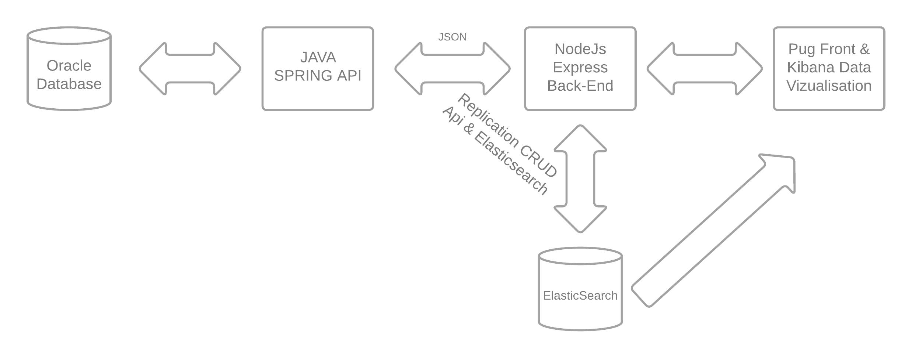
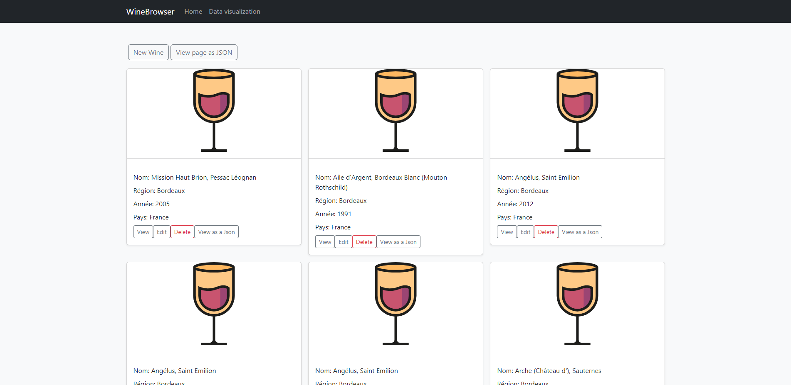
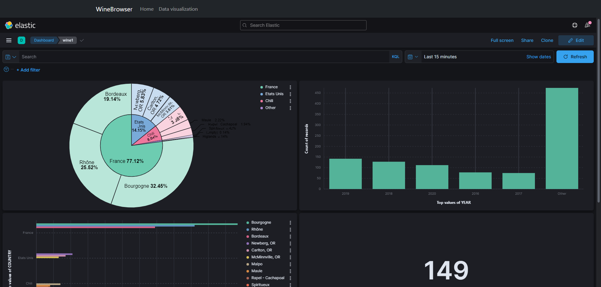

# WineBrowser

WineBrowser est une application développée en Javascript(NodeJs) qui permet la gestion d'une base de données de vins.
##Architecture

Le Back-End(WineBrowser) en NodeJs vient piloter l'ensemble du projet.
Elle communique via des appels Json au Web service WineWebService (Java Spring). (https://github.com/Fourkap/WineWebService) 

WineBrowser vient également communiquer avec ElasticSearch afin de gérer la partie requêtage sur les vins.

##Application Web
L'application web est composée de deux grandes parties:

- Une partie pour la gestion des vins (Création, Visionnage, Modification, Suppression)
- Une partie pour le requêtage et la visualisation des vins via Kibana.


## Installation

1: Download/clone des deux projets WineWebService et WineBrowser

```
https://github.com/Fourkap/WineWebService/tree/master
https://github.com/Fourkap/WineBrowser
```
2: Installation des dépendances de chacunes des deux applications (NodeJs, Java Spring)

3: Installation et configuration des deux sources de données (Oracle, ElasticSearch)

4: Configuration dans WineBrowser des adresses Ip du Web Service et d'ElasticSearch.